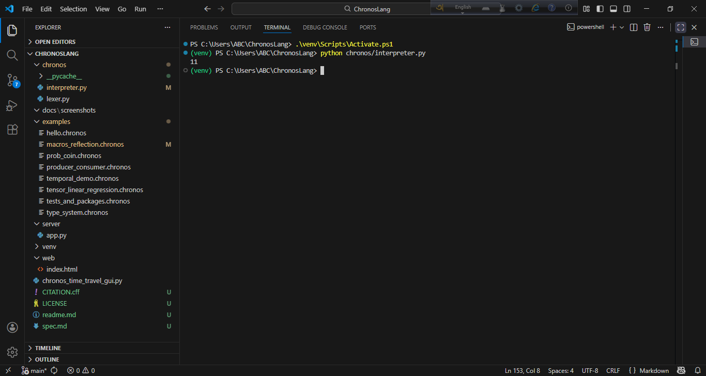
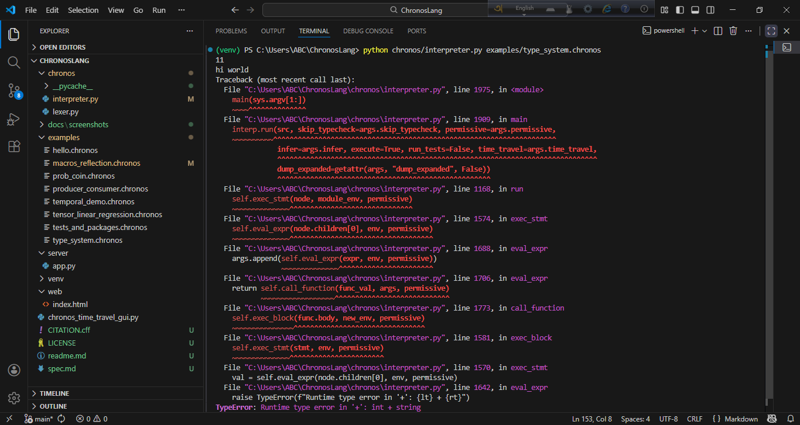
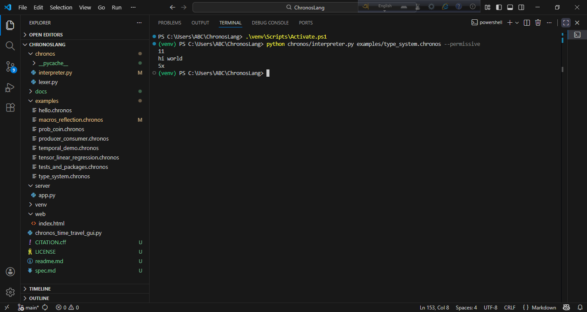
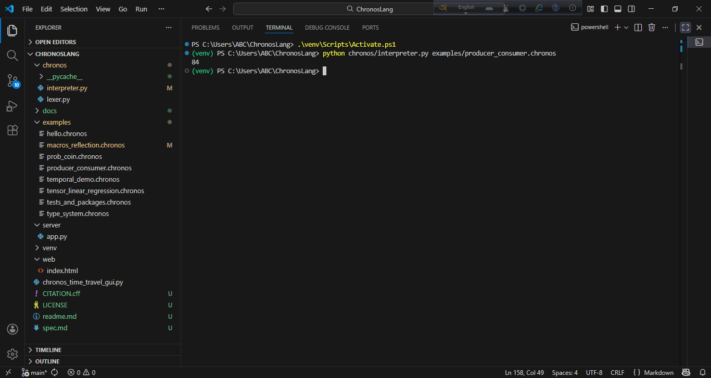
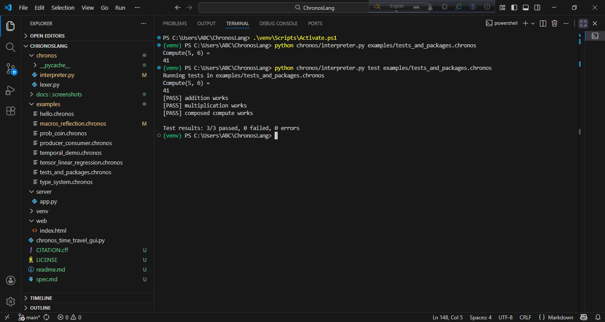
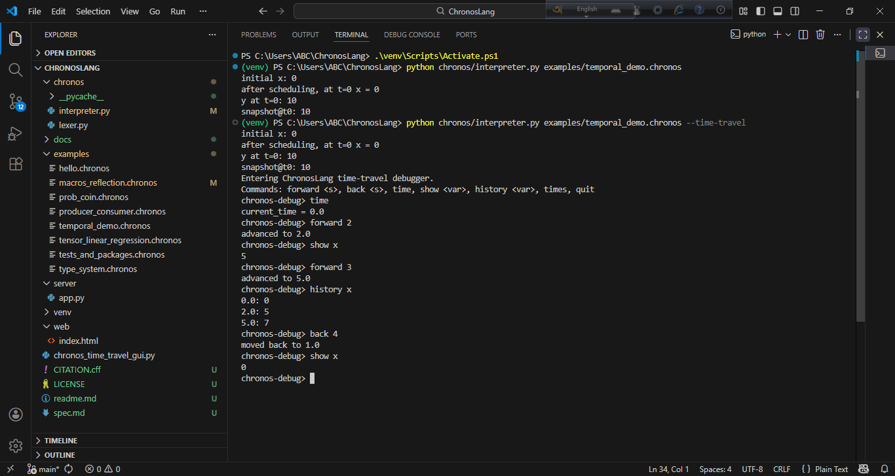
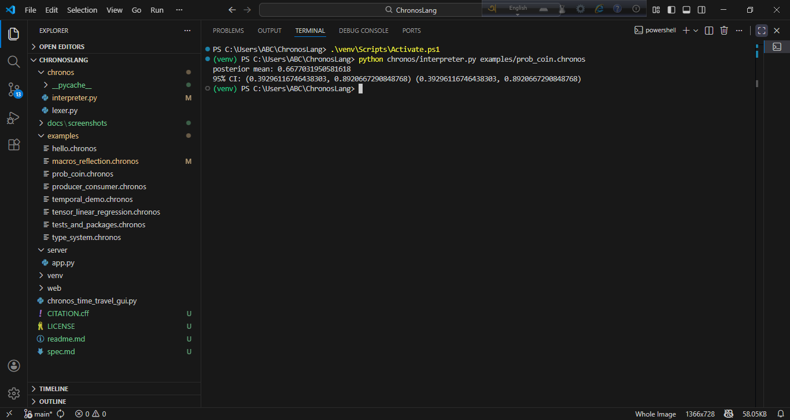
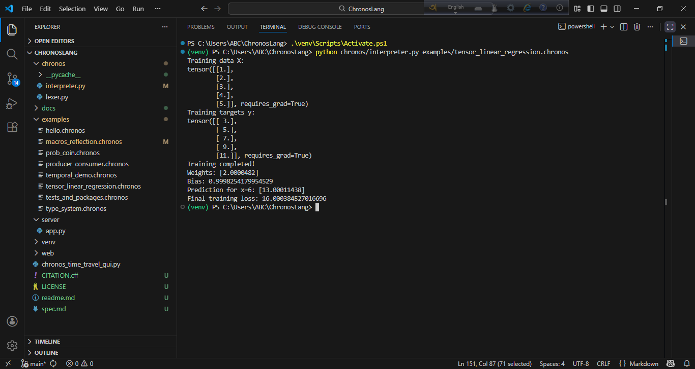
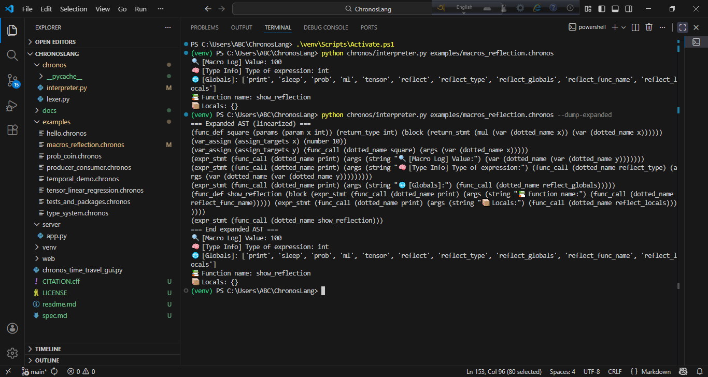

###### ChronosLang — Language Specification & Developer Guide

### Table of contents

1. Introduction & Motivation

2. Quickstart (run & test)

3. Language overview (core concepts)

4. Concrete syntax — examples and idioms

5. Formal grammar (EBNF & Lark)

6. Execution model & runtime components

7. CLI: run / test / build (flags & behavior)

8. Web Runner (FastAPI) & Browser UI

9. Time-travel engine & debugger

10. Macros, macro expansion, and compile-time behavior

11. Reflection API (runtime)

12. Probabilistic & ML modules

13. Interactive Examples

14. Error messages, debugging tips

##### 1. Introduction & Motivation

ChronosLang is a compact, experimental programming language and interpreter built around three 
interlocking research-first capabilities:

 
⬤ Time-native programming. ChronosLang makes time a first-class part of the language: variables can be 
temporal (they carry a time-indexed history), assignments may be scheduled for future logical times, and 
a global Timeline allows programs and tools to move forward and backward through logical time. This 
enables reproducible time-based demos, exploratory “time-travel” debugging, and simple temporal 
reasoning inside programs.

⬤ Lightweight concurrency. The language exposes simple, deterministic concurrency primitives inspired 
by Go: go for background execution and unbuffered rendezvous channels (make(chan), ch <- v, <- ch). 
These primitives are intentionally minimal so concurrency behavior is easy to reason about and suitable 
for teaching, demos, and deterministic small-scale experiments.

⬤ Hygienic compile-time macros + runtime reflection. ChronosLang supports compile-time macros for 
AST-level transformations and a small runtime reflection API (reflect, reflect_type, reflect_globals, 
etc.) so programs can introspect and reason about their own structure and state. Macros let you build 
small language extensions and compile-time instrumentation without complicating the runtime semantics.

**Why I created ChronosLang**

ChronosLang was designed to address a set of gaps I saw in research demos, teaching tools, and prototype 
languages:

⬤ Make temporal reasoning simple and visible. Many systems let you schedule callbacks or log events, 
but few treat variable histories and timeline scrubbing as first-class concepts. ChronosLang makes it 
easy to express and inspect how values evolve over time, which is useful for debugging reactive systems, 
teaching stateful algorithms, and prototyping time-aware AI agents.

⬤ Provide deterministic, easy-to-understand concurrency for demos. Full-featured concurrency libraries 
are powerful but noisy for short demos. The rendezvous channel + go model gives visual, deterministic 
concurrency that’s ideal for short, reproducible demonstrations and teaching concurrency concepts 
without the usual nondeterministic pitfalls.

⬤ Enable language-level experiments with macros and reflection. For research into language extensions,   
macros give transformation power and reflection gives insights into running systems — together they 
lower the barrier to experimenting with meta-level features (e.g., instrumentation, lightweight DSLs, or 
GPT-assisted code transforms).

##### 2. Quickstart (Run & Test)

Step 0: Install Python & Clone Repository

Install Python 3.13 (or compatible version) if not already installed:

Download Python

Ensure python (or python3) is in your PATH.

Clone the repository:

git clone https://github.com/Srijon25/ChronosLang.git
cd ChronosLang

Step 1: Create and Activate Virtual Environment
# Create venv
python -m venv venv

# On Linux / Mac
source venv/bin/activate

# On Windows (PowerShell)
.\venv\Scripts\Activate.ps1

⚠️ Windows note: If you see “execution of scripts is disabled,” open PowerShell as Administrator and run:

Set-ExecutionPolicy RemoteSigned

Type Y to confirm, then re-run activation.

step 2: pip install lark, numpy, pyqt5 (GUI), fastapi + uvicorn (web-runner), torch (ML acceleration).

step 3: 

Run default example file (examples/hello.chronos)

REPL Command: python chronos/interpreter.py 
Run other example files

REPL Commands: python chronos/interpreter.py examples/type_system.chronos
               python chronos/interpreter.py examples/type_system.chronos --permissive (optional)
               python chronos/interpreter.py examples/producer_consumer.chronos
               python chronos/interpreter.py examples/tests_and_packages.chronos
               python chronos/interpreter.py test examples/tests_and_packages.chronos
               python chronos/interpreter.py examples/temporal_demo.chronos
               python chronos/interpreter.py examples/temporal_demo.chronos --time-travel
               python chronos/interpreter.py examples/prob_coin.chronos
               python chronos/interpreter.py examples/tensor_linear_regression.chronos
               python chronos/interpreter.py examples/macros_reflection.chronos
               python chronos/interpreter.py examples/macros_reflection.chronos --dump-expanded
                                                                                          

PyQt5 GUI (time-travel debugger prototype)

REPL Command: python chronos_time_travel_gui.py 

Web-runner (browser UI served by FastAPI)

REPL Command: uvicorn server.app:app --reload --port 8000
# then open the local URL and use the web editor

##### 3. Language overview (core concepts)

ChronosLang is a small, research-first language and interpreter that puts time, concurrency, and 
introspection at the center. It supports temporal variables with scheduled assignments and time-travel 
inspection, goroutine-style concurrency with rendezvous channels, hygienic compile-time macros, and 
runtime reflection — all implemented in a compact, teachable interpreter.

**Core features (by week) — what was added and where to find the demo**

Week 1 — Core interpreter

What: Basic interpreter with parsing, functions, arithmetic, print().

Demo file: examples/hello.chronos

Example: function add(a, b): return a + b → print(add(5,6))

Week 2 — Static type system + inference

What: Conservative TypeChecker with optional --permissive mode exists for lenient testing.

Demo file: examples/type_system.chronos

Notes: Type inference helps document function contracts; permissive mode can be used in the web demo to 
avoid breaking on type mismatches during exploration.

Week 3 — Concurrency

What: go for background execution, unbuffered rendezvous Channel (make(chan TYPE)), ch <- val, <- ch.

Demo file: examples/producer_consumer.chronos

Example: worker/producer-consumer patterns.

Week 4 — Test & package skeleton

What: run, test, build CLI subcommands; embedded test blocks test "..." with assert.

Demo file: examples/tests_and_packages.chronos

Usage: python chronos/interpreter.py test examples

Week 5 — Temporal engine & time travel

What: temporal variables, scheduled assignments x = 5 @ t+2s, Timeline with run_to, step_forward, 
step_backward.

Demo file: examples/temporal_demo.chronos

Usage: python chronos/interpreter.py examples/temporal_demo.chronos --time-travel

Week 6 — Probabilistic core

What: Lightweight distributions (Uniform, Normal, Bernoulli), prob.* API, importance sampling & MH 
backends.

Demo file: examples/prob_coin.chronos

Example: posterior = prob.infer(theta, [obs], "importance", 5000)

Week 7 — ML core

What: tensor wrapper, optional PyTorch backend, ml.linear_regression_train (autodiff if torch present, 
closed-form fallback).

Demo file: examples/tensor_linear_regression.chronos

Notes: Interface returns native arrays/tensors; demo shows training, prediction, loss.

Week 8 — Time-travel GUI (PyQt5 prototype)

What: chronos_time_travel_gui.py — slider, play/pause, variable list, variable history view. Loads 
prelude, schedules and lets user scrub timeline.

Limitation: GUI shows runtime temporal variables and their history but does not support macros/
reflection (macros are compile-time; reflection values that require current-execution context are not be 
available in GUI ).

Note for web UI: GUI logic inspired the browser runner but PyQt is separate; browser UI uses FastAPI 
endpoints.

Week 9 — Macros & Reflection

What: Compile-time macro definitions (collected and expanded before runtime), and reflect runtime object 
exposing:

reflect.vars(), reflect.functions(), reflect.timeline(), reflect.inspect(name), reflect.macros().

Demo file: examples/macros_reflection.chronos

Important: Macros are removed from runtime AST (compile-time only) — that’s why time-travel GUI can’t 
“execute” macro expansion live as a runtime event. Reflection inspects runtime environment; some 
reflection results depend on execution context (e.g., current function locals) and thus are best shown 
in CLI runs rather than the GUI prelude snapshot.

Week 10 — Web runner & Browser UI (FastAPI + index.html)

What: FastAPI endpoints /run and /upload (run a .chronos file or code snippet), simple browser editor at 
web/index.html.

Files: server/app.py and web/index.html

##### 4. Concrete syntax — examples and idioms

ChronosLang syntax is designed to be compact, explicit, and readable. Below are canonical examples 
illustrating each core concept.

4.1 Functions & Expressions
# Define a function
function add(a: int, b: int) -> int:
    return a + b

# Type inference allows omission of types
function auto_add(a, b):
    return a + b

# Call a function
print(add(5, 6))
print(auto_add("hi", " world"))

Key points:

    ● Indentation-based blocks (like Python)

    ● return mandatory to return a value

    ● Functions may optionally have type annotations

    ● Supports arithmetic, comparisons, lists, function calls

Demo: examples/hello.chronos, examples/type_system.chronos

4.2 Variables & Temporal Variables
# Normal variable
x = 42

# Temporal variable
temporal y = 10

# Scheduled assignment in future
y = 20 @ t+3s

# Access current value
print(y)

Key points:

    ● temporal creates a time-aware variable

    ● Scheduled updates @ t+Ns are applied by the ChronosEngine timeline

    ● CLI --time-travel allows scrubbing past/future states

    ● Temporal vars work only for runtime state, macros are compile-time and not shown in timeline

Demo: examples/temporal_demo.chronos

4.3 Concurrency — Goroutines & Channels
function worker(ch):
    data = <-ch        # receive
    ch <- data * 2     # send

ch = make(chan int)
go worker(ch)          # spawn background worker

ch <- 42               # send
print(<-ch)            # receive result

Key points:

    ● go spawns a concurrent execution

    ● Channels are unbuffered rendezvous channels

    ● Use <- ch to receive, ch <- value to send

    ● Concurrency is deterministic in examples for reproducibility

Demo: examples/producer_consumer.chronos

4.4 Macros
# Compile-time macro
macro log(expr):
    print("🔍 [Macro Log] Value:", expr)

macro debug_type(expr):
    print("🧠 [Type Info] Type:", reflect_type(expr))

macro list_globals():
    print("🌐 Globals:", reflect_globals())

x = 10
log(x)
debug_type(x)
list_globals()

Key points:

    ●  Macros are expanded at compile-time

    ●  Do not exist in runtime AST → not shown in time-travel GUI

    ●  Useful for code generation, logging, debugging

    ●  an take parameters and inline arbitrary ChronosLang code

Demo: examples/macros_reflection.chronos

4.5 Reflection
function show_reflection():
    print("Function name:", reflect_func_name())
    print("Locals:", reflect_locals())
    print("Timeline:", reflect.timeline())
    print("Inspect 'x':", reflect.inspect("x"))

show_reflection()

Key points:

    ● Access runtime environment: functions, variables, temporal state

    ● Some reflection values depend on the execution context (inside a function call)

Demo: examples/macros_reflection.chronos

4.6 Probabilistic Programming
theta = prob.uniform(0.0, 1.0)
obs = prob.binomial(theta, 10, 7)
posterior = prob.infer(theta, [obs], "importance", 5000)
print("Posterior mean:", posterior.mean())

Key points:

    ● prob.* API: Uniform, Bernoulli, Normal

    ● Supports simple inference backends (importance sampling, MCMC)

    ● Integration with temporal variables and functions is seamless

Demo: examples/prob_coin.chronos

4.7 Machine Learning / Tensor Examples
X = tensor([[1.0], [2.0], [3.0]])
y = tensor([[2.0], [4.0], [6.0]])

w, b = ml.linear_regression_train(X, y, 500, 0.01)

y_pred = ml.add(ml.matmul(X, w), b)
loss = ml.mse_loss(y_pred, y)
print("Prediction:", y_pred, "Loss:", loss)

Key points:

    ● Optional PyTorch backend; fallback to NumPy if unavailable

    ● Supports tensor operations, linear regression, MSE loss, autodiff (if torch present)

Demo: examples/tensor_linear_regression.chronos

4.8 Idioms / Best Practices

    ● Prelude separation for GUI: code before tests or main functions can be executed in time-travel 
      GUI.

    ● Temporal updates: schedule updates relative to t+Ns or absolute times for reproducible 
      experiments.

    ● Use --permissive in demos: avoids runtime TypeErrors, ensures smooth execution in web runner.

    ● Macro placement: define macros at top of file to ensure proper compile-time expansion.

**Reviewer Note — Time-Travel GUI**

The time-travel debugger can:

✅ Scrub temporal variable histories
❌ Cannot display macro expansions
❌ Cannot display reflection values that depend on active function calls

This is expected and consistent with the design:

 ● Macros = compile-time

 ● Reflection = runtime call-frame

 ● Temporal = timeline state

##### 5. Formal grammar (EBNF & Lark)

ChronosLang syntax is defined with a context-free grammar (EBNF style) and implemented using Lark. The 
following describes the grammar and preprocessor rules.

**5.1 Core Grammar (EBNF)**
start         ::= stmt*

stmt          ::= var_assign
                | temporal_decl
                | func_def
                | macro_def
                | return_stmt
                | expr_stmt
                | go_stmt
                | test_def
                | assert_stmt

// Function definitions
dotted_name   ::= NAME ("." NAME)*
func_call     ::= dotted_name "(" args? ")"
args          ::= expr ("," expr)*

func_def      ::= "function" NAME "(" params? ")" return_type? ":" block
params        ::= param ("," param)*
param         ::= NAME (":" TYPE)?
return_type   ::= "->" TYPE

block         ::= "{" stmt* "}"

macro_def     ::= "macro" NAME "(" params? ")" ":" block

// Variable assignments
temporal_decl ::= "temporal" NAME "=" expr time_spec?
assign_targets ::= NAME ("," NAME)*
var_assign    ::= assign_targets "=" expr time_spec?

return_stmt   ::= "return" expr
expr_stmt     ::= expr
go_stmt       ::= "go" expr

test_def      ::= "test" STRING ":" block
assert_stmt   ::= "assert" expr

// Expressions
expr          ::= comp
comp          ::= comp "==" sum -> eq
                | comp "!=" sum -> ne
                | comp "<" sum  -> lt
                | comp "<=" sum -> le
                | comp ">" sum  -> gt
                | comp ">=" sum -> ge
                | sum

sum           ::= sum "+" term -> add
                | sum "-" term -> sub
                | term

term          ::= term "*" factor -> mul
                | term "/" factor -> div
                | factor

factor        ::= NUMBER        -> number
                | STRING        -> string
                | list_literal
                | func_call
                | dotted_name   -> var
                | "(" expr ")"
                | send
                | recv
                | type_expr

list_literal  ::= "[" [expr ("," expr)*] "]"

send          ::= NAME "<-" expr   // channel send: ch <- value
recv          ::= "<-" NAME        // channel receive: <- ch

type_expr     ::= "chan" TYPE       // channel type, e.g., chan int

time_spec     ::= "@" "t" "+" NUMBER ("s")?  // scheduled assignment: @ t+2s

Terminals:

NAME          ::= /[a-zA-Z_][a-zA-Z0-9_]*/
NUMBER        ::= /[+-]?[0-9]+(\.[0-9]+)?/
STRING        ::= ESCAPED_STRING
TYPE          ::= "int" | "float" | "string" | "auto"

Ignored tokens:

Whitespace: /[ \t\f\r\n]+/
Comments:   /#[^\n]*/

**5.2 Preprocessor: Indentation → Braces**

ChronosLang uses Python-style indentation but converts blocks into explicit braces { … }:

def preprocess_indent(src: str) -> str:
    """
    Convert Python-style indentation to explicit { ... } blocks.
    Minimal, intended for small demo programs.
    """
    lines = src.splitlines()
    out_lines = []
    indent_stack = [0]

    for i, raw in enumerate(lines):
        if raw.strip() == "":
            continue
        stripped = raw.lstrip(" \t")
        indent = len(raw) - len(stripped)

        # Close blocks on dedent
        while indent < indent_stack[-1]:
            out_lines.append("}")
            indent_stack.pop()

        # Check if previous line ends with ":" → open block
        j = i - 1
        prev_raw = ""
        while j >= 0:
            if lines[j].strip() == "":
                j -= 1
                continue
            prev_raw = lines[j]
            break
        prev_code = prev_raw.split("#", 1)[0].rstrip() if prev_raw else ""
        if prev_code.endswith(":") and indent > indent_stack[-1]:
            out_lines.append("{")
            indent_stack.append(indent)

        out_lines.append(stripped)

    # Close remaining blocks
    while len(indent_stack) > 1:
        out_lines.append("}")
        indent_stack.pop()

    return "\n".join(out_lines)

Notes:

    ● Converts indentation-based code into brace-delimited blocks for the parser.

    ● Supports nested blocks, functions, macros, if/else (future expansion).

    ● Minimalistic: intended for small example programs and research demos.

**5.3 Lark Parser Integration**
from lark import Lark

parser = Lark(
    chronos_grammar,
    parser="lalr",
    propagate_positions=True,
)

propagate_positions=True preserves line/column information for debugging and error messages.

The parser consumes preprocessed source (preprocess_indent(src)).

Supports all language features, including:

    ● Functions, macros, reflection

    ● Temporal variables & scheduled assignments

    ● Concurrency primitives (go, make(chan), send/recv)

    ● Tests and assertions

##### 6. Execution Model & Runtime Components

ChronosLang executes programs through a layered architecture combining a static type checker, macro 
expander, temporal runtime, and optional probabilistic and ML engines. The model balances deterministic 
reproducibility with temporal and concurrent dynamics, making it suitable for simulation, research, and 
visualization.

## 6.1 Execution Pipeline Overview

Every .chronos file passes through five main phases:

| Phase                  | Component                                             | Description          |
| **1. Preprocessing**   | `preprocess_indent()`                                 | Converts 
indentation-based syntax to brace-delimited blocks for the parser.  |
| **2. Parsing**         | `lark.Lark(chronos_grammar)`                          | Builds an Abstract 
Syntax Tree (AST) from the preprocessed source.  |
| **3. Macro Expansion** | `MacroExpander` (within `Interpreter.collect_macros`) | Rewrites the AST by 
inlining macro bodies and removing compile-time nodes.  |
| **4. Type Checking**   | `TypeChecker`                                         | Performs static type 
inference and validation; can run in strict or `--permissive` mode. |
| **5. Execution**       | `ChronosEngine`                                       | Evaluates the AST 
with full temporal, probabilistic, and ML semantics.  |

At runtime, the interpreter constructs an environment object:

env = {
    "globals": {},         # global vars, functions, temporal vars
    "timeline": Timeline(),# central temporal state tracker
    "threads": [],         # spawned goroutines
    "reflect": Reflect(),  # reflection API
}

## 6.2 Core Components

**ChronosEngine**

● Responsible for managing temporal variables, scheduled assignments, and logical time progression.

● Tracks each temporal variable’s timeline of states.

● Supports reversible operations (move backward or forward in simulated time).

● Interface CLI time-travel commands:

    ► forward N → move time forward by N seconds.

    ► back N → rewind logical time by N seconds.

    ► show x, history x → inspect variable timeline.

Example timeline entry:

    timeline = {
    "x": [(0.0, 0), (2.0, 5), (5.0, 7)]
}

At t=0, x = 0 → updated to 5 at t=2 → 7 at t=5.

**Macro Engine**

Executed before runtime.

Macros are stored temporarily during AST collection and expanded recursively.

    ► No macro nodes remain in the final runtime AST.

    ► Expansion happens top-down and in order of definition.

    ► Macros can include arbitrary ChronosLang code fragments.

    ► Output may differ across runs if macros depend on external data.

Special CLI flag:

   --dump-expanded   # shows post-expansion source for debugging

Macros never appear in the time-travel GUI, since they exist only at compile-time.

**TypeChecker**

Handles both explicit and inferred types:

    ► Supports int, float, string, auto, chan TYPE, and composite types (lists, tensors).

    ► Permissive inference (--permissive) allows mixed operations for smoother demos.

    ► Static types are checked once before runtime; temporal updates are re-validated dynamically at 
    execution.

**Concurrency Engine**

Provides deterministic goroutine-style concurrency via Python threads and synchronized channels.

    ► go expr spawns a background worker.

    ► Channels are rendezvous (unbuffered) objects implemented as queue.Queue(maxsize=1).

    ► Communication blocks until sender and receiver meet.

    ► All goroutines run as daemon threads, so they exit cleanly when the main program ends.

Example behavior:

   ch = make(chan int)
   go worker(ch)
   ch <- 42
   print(<-ch)

Order of operations is deterministic for reproducible demo runs.

**Reflection System**

The reflect object provides runtime introspection.

Methods include:

   reflect.vars()         # list all global variables
   reflect.functions()    # list all functions
   reflect.timeline()     # show temporal history summaries
   reflect.inspect(name)  # inspect a variable’s current state
   reflect_func_name()    # current function name
   reflect_locals()       # current local variables

Limitations:

    ► Reflection inside goroutines may return partial local states.

    ► Time-travel GUI shows only temporal reflection data, not compile-time macro expansions.

**Probabilistic Core (prob.*)**

Implements lightweight probabilistic programming:

    ► Distributions: uniform, bernoulli, normal, binomial

    ► Inference methods: "importance", "mcmc"

    ► Posterior objects support .mean(), .credible_interval(p)

Designed for deterministic seeds in GUI demos to ensure reproducibility.

**Machine Learning Core (ml.*)**

Wrapper around NumPy or PyTorch:

    ► Tensor creation: tensor([...])

    ► Operations: add, matmul, mse_loss

    ► Training helper: ml.linear_regression_train(X, y, steps, lr)

    ► Optional autodiff if torch backend available.

Works seamlessly with the rest of the runtime — tensors can be stored in temporal variables or channels.

## 6.3 Time-Travel Debugger & GUI Layer

The ChronosLang GUI provides a simple but functional time-travel debugger that allows developers to load 
a program, run it, and step through its execution timeline.

What the GUI Actually Does

● Open a .chronos file
  The “Open .chronos” button allows the user to browse their file system and select a ChronosLang source 
  file.

● Run the program
  After loading the file, clicking Run Prelude the program using the ChronosEngine backend.

● Display variable values
  Once running, the GUI shows:

     ► all current variables

     ► their latest values

     ► updates appearing live as the program progresses

● Play (time-travel playback)
  When the user types play (or clicks the play button if you have it), the GUI:

     ► replays previously recorded states

     ► shows how variables changed over time

     ► steps through the execution timeline frame-by-frame

This feature represents time debugging — you can move through earlier moments of execution and see the 
variable values exactly as they were then.

⚠ Limitations (Important & Honest)

macros_reflection.chronos does NOT work in the GUI.

Why:

● The GUI runner only supports runtime execution, not compile-time macro expansion.

● Reflection and macro expansion happen before the time-travel engine receives the trace.

● Since the GUI uses the simplified engine path:

     ► macros are not expanded

     ► reflection API calls are not captured

     ► the file cannot run correctly inside the GUI

## 6.4 Execution Semantics Summary

| Feature                               | When evaluated         |Recorded in timeline?|Shown in GUI?   |
| -------------------------------------| ------------------------| ------------------|------------------|
| Normal variable (`x = 5`)            | Runtime (t=now)         | ✅                | ✅              |
| Temporal variable (`temporal x = 0`) | Runtime                 | ✅                | ✅              |
| Scheduled assignment (`x = 5 @ t+2s`)| Deferred (ChronosEngine)| ✅                |✅               |
| Macro (`macro log(x)`)               | Compile-time            | ❌                | ❌               
| Reflection (`reflect.vars()`)        | Runtime                 | Partial           | Partially        |
| Goroutine / channel send/recv        | Runtime (threaded)      | ✅                 | ✅                |
| Probability / ML ops                 | Runtime               | ✅(final values only)|✅                |
| Test/assert blocks                   | Runtime (post-execution) | ❌                | Optional summary|

## 6.5 Thread Safety & Determinism

ChronosLang prioritizes deterministic replay:

    ► All random, temporal, and concurrent operations are timestamped or seeded deterministically.

    ► Time-travel replay produces identical states for identical inputs.

    ► Probabilistic inference can be seeded globally (prob.set_seed(seed)).

Thread interactions via channels are serialized to preserve reproducibility.

## 6.6 Error Handling

    ► Type errors: raised before execution unless --permissive is active.

    ► Runtime errors: caught, logged, and optionally displayed in GUI console.

    ► Temporal conflicts: last scheduled assignment at same timestamp wins (documented deterministic 
    rule).

    ► Reflection errors: if variable not found, reflect.inspect(name) returns "undefined".

## 6.7 Integration Hooks

● CLI Interface:

python chronos/interpreter.py run file.chronos [--time-travel] [--permissive]

● GUI Layer:
Invokes ChronosEngine with observer hooks to display variable history.

● Testing:
test and assert nodes are executed after main body; failures reported but do not halt GUI unless strict 
mode is enabled.

✅ Summary

The ChronosLang runtime is a temporal–reflective–deterministic execution model integrating:

    ► Compile-time macro expansion

    ► Type-checked deterministic concurrency

    ► Temporal scheduling and reversible simulation

    ► Optional probabilistic and ML subsystems

    ► Real-time visual debugging via the time-travel GUI

Together, these components make ChronosLang one of the few educational/research languages that unifies 
time, concurrency, and reflection in a single consistent execution semantics.

##### 7. CLI: run / test / build (flags & behavior)

This section documents the user-facing CLI you ship with chronos/interpreter.py and the meaning / 
interactions of the flags you implemented.

**Commands (summary)**

    ► python chronos/interpreter.py run <path>
       Parse → macro-expand → (optionally type-check) → execute prelude. By default executes prelude 
       (top-level) nodes then exits.

    ► python chronos/interpreter.py test <path|dir>
       Runs test blocks (test "name": { ... }) found in the file(s). Each test runs in a fresh child 
       environment so tests are isolated.

    ► python chronos/interpreter.py build <path>
       Type-check-only workflow (no execution). Useful for CI / demos where you want to validate 
       signatures.

**Important flags**

● --permissive
   Enables relaxed runtime and some permissive type-handling. Practically:

     ► TypeChecker errors can be downgraded to warnings (if catch is implemented).

     ► Runtime operations that would otherwise raise on type mismatch (e.g., string + int) may coerce 
        or continue with a warning.

     ► Recommended for demo/web-runner to avoid user-visible crashes.

● --skip-typecheck
   Skip static checking entirely. Use for fastest demo runs or to run intentionally untyped examples. 
   Dangerous for complex programs—runtime errors may be less predictable.

● --time-travel
   After executing the prelude, enter the interactive time-travel REPL (CLI debugger) that allows 
   forward N, back N, show name, history name, times, etc.

● --dump-expanded
   Print the AST / source after macro expansion. Helpful for debugging macros and to show what the 
   compiler produced.

Exit codes / outputs

    ► Normal run returns 0 on success.

    ► test returns non-zero when any test fails.

    ► Uncaught runtime exceptions propagate to stderr (interpreter prints them); in automated callers 
      (web runner) capture stdout/stderr and return them to the caller.

 

##### 8. Web Runner (FastAPI) & Browser UI

This documents server/app.py (or app.py) and the web/index.html browser UI you added. It summarizes 
endpoints, data flows, safety considerations, and UX.

**Server endpoints (the FastAPI app you provided)**

● GET /
Returns web/index.html if web exists, otherwise a small landing HTML.

● GET /health
Returns JSON status, python path, and whether chronos/interpreter.py exists.

● POST /run
   Accepts either JSON or multipart/form-data.

    ► JSON payload shape: { "code": "...", "filename": "example.chronos", "flags": ["--permissive"] }

    ► Form fields: code (text), filename (optional), flags (comma-separated string)

    ► Server writes the code to a temporary .chronos file, runs: <python> chronos/interpreter.py run    
      <tmpfile> [flags...], captures stdout/stderr, and returns JSON:

      {
        "returncode": 0 | null,
        "stdout": "...",
        "stderr": "...",
        "timed_out": false | true,
        "cmd": "<full command used>"
      }

    ► Temporary directory is removed after run.

    ► A default timeout (e.g., 20s) is enforced to avoid runaway processes.

● POST /upload
   Accepts a .chronos file upload (file field) and optional flags. Behavior mirrors /run.

● Static mounting: app.mount("/static", StaticFiles(directory="web", html=True), name="static") or      
   serving web/ at /.

**Browser UI (web/index.html)**

● Editor textarea for inline code.

● Filename input (default example.chronos).

● Checkboxes for flags: permissive, skip-typecheck, infer, dump-expanded.

● Buttons:

    ► Run (paste): POSTs the code to /run and displays combined stdout/stderr/return code in the   
      output  pane.

    ► Upload & Run: posts a selected .chronos file via /upload.

● Output pane shows:

    ► [Timed out] marker if timed out

    ► === STDOUT ===, === STDERR ===, === RETURN CODE ===

**Server implementation notes (what your app.py does / expects)**

● Uses the same Python executable (sys.executable) to run the interpreter; this helps avoid CI / venv 
  mismatches.

● Builds command as PYTHON CHRONOS_INTERPRETER run <path> [flags...], with CHRONOS_INTERPRETER resolved 
  to chronos/interpreter.py.

● Uses subprocess.run(..., capture_output=True, text=True, timeout=...).

● Uses temporary directories for safety and cleans them up after the subprocess completes.

● Returns a JSON object with stdout, stderr, returncode, timed_out, and optionally cmd for debugging.

**Security & deployment cautions (critical)**

● Executing user-supplied code on the server is dangerous. Your current setup runs arbitrary .chronos 
  code using the same Python process. That code can:

    ► Access filesystem (read/write)

    ► Spawn arbitrary subprocesses

    ► Consume CPU / memory

● Mitigations you should consider for public hosting:

    ► Run the interpreter inside a hardened sandbox (container, gVisor, Firecracker).

    ► Enforce strict resource limits (CPU, memory, process count).

    ► Drop network access for the child process unless explicitly needed.

    ► Run in an isolated user account with minimal privileges.

    ► Validate / sanitize uploaded filenames and contents.

    ► Keep timeout conservative and return clear timeouts to users.

● For local demos or offline MIT showcase, running on your laptop behind a firewall is fine. Do not 
  publish the server without sandboxing.

**UX suggestions (small, non-invasive)**

● Keep permissive checkbox checked by default for demo playback to reduce crashes.

● Hide advanced flags in the UI behind an “Advanced” panel; novices should only see permissive.

● Show cmd and timed_out only in a collapsible “Debug” view.

##### 9. Time-travel engine & debugger (internals & limitations)

This section describes how ChronosLang’s time-travel system works internally, how the CLI/GUI debugger 
manipulates time, and the important limitations (macros, reflection, concurrency, and precision). It 
matches the exact behavior of the current implementation.

### Data structures (as implemented)

## TemporalVar

A variable with a full history of its values over time.

**Fields**

● name

● timeline (reference to global Timeline)

● times — sorted list of timestamps

● values — parallel list of values

**Methods**

● set_at(t, value)
  Inserts or replaces the value at time t (uses bisect for sorted insertion).

● value_at(t)
  Returns the most recent value whose time ≤ t.

● history()
  Returns [(time, value), ...] pairs for GUI display.

## Timeline

**Fields**

● current_time : float

● _events : dict[time → list[(name, value)]]
  Scheduled assignments waiting to be applied.

● _sorted_times : list[float]
  Sorted list of future event times.

**Methods**

● schedule(at_time, name, value)
  Schedules a future assignment.

● times()
  Returns all scheduled times (GUI uses this to generate the slider max-value).

● run_to(t, env)
  Advances logical time:

    ► Applies all events with time > current_time and time <= t, in order.

    ► When applying an event:

       ✦ If the variable already exists and is TemporalVar, call set_at.

       ✦ If the variable exists but is not temporal, it is converted into a TemporalVar, preserving the 
          old value at the current timeline time (usually 0 during prelude).

       ✦ If the variable does not exist, create a TemporalVar with an initial value None at time 0, then 
          set at event_time.

    ► Applied events are removed from the scheduler, but their history remains inside the TemporalVar.

    ► This makes timeline scrubbing possible without re-executing code.

● step_forward(seconds, env)

● step_backward(seconds)
  Only rewinds the pointer (current_time).
  It does not re-run or reverse code — history is read from TemporalVar.

**GUI Mapping & Time Scrubbing**

● The GUI computes the slider range from 0 to the maximum scheduled time plus tiny padding.

● Slider resolution is fixed (e.g., 1000 steps); very fine-grained time steps may be visually merged.

● When the slider moves:

    ► Convert slider position → timeline time t

    ► Call timeline.run_to(t, module_env)
      (forward-only application of events; backward is pointer-only)

    ► Display:

       ✦ current value for each temporal variable (value_at(t))

       ✦ full history (history())

**Determinism & Reproducibility**

● Scheduled events are applied strictly in increasing time order.

● If multiple events share the same timestamp, they are applied in insertion order (the order schedule() 
  was called during prelude).

● For reproducible demos involving randomness, users should set a fixed RNG seed.

**Important Limitations**

● Macros are compile-time only

    ► Macros expand before running the prelude or time-travel engine.

    ► They do not create timeline events.

    ► GUI cannot show macro expansion or “macro-level time.”

● Reflection is runtime and context-sensitive

    ► reflect shows:

       ✦ module-level state in GUI prelude mode

       ✦ full state (globals, locals, call frame) only during function execution in CLI mode.

    ► The GUI cannot show reflection data that requires an active call frame.

● Concurrency (go / goroutines) is real-time, not time-traveled

    ► go spawns real Python threads immediately.

    ► Thread side effects are not reversible:

       ✦ They do not appear in the timeline.

       ✦ They are not undone when you scrub time backwards.

    ► Threads may mutate non-temporal global state in ways the GUI cannot track.

Recommendation:

For fully reversible demos, avoid goroutines in prelude code intended for time-travel.

● Time-travel re-application model (critical to understand)

ChronosLang uses a “single-application + persistent history” model:

    ► Once an event is applied by run_to, it is removed from _events.

    ► But the effect is stored permanently inside the TemporalVar history.

    ► Rewinding does not re-run code or re-apply events — it only moves the pointer.

    ► Moving forward again simply queries existing history (value_at) instead of re-running.

This allows deterministic scrubbing without needing full reverse execution.

● Background thread state during prelude

    ► If the prelude spawns threads, their execution timing is nondeterministic.

    ► GUI timeline becomes inaccurate because thread operations do not synchronize with scheduled events.

Reliable demos should schedule with:

x = value @ t+2s

instead of relying on thread timing.

● Precision & slider resolution

    ► Slider has finite resolution (e.g., 1000 steps).

    ► Extremely small deltas (1e-4 seconds) may be visually merged.

    ► For predictable demos, use timestamps like t+0.1s, t+1.0s, etc.

##### 10. Macros, macro expansion, and compile-time behavior

**What macros are**

Macros in ChronosLang are compile-time code transformers. They are written in ChronosLang itself using 
macro definitions and are executed by the interpreter during the parse/expand phase — before any runtime 
execution, scheduling, or timeline bookkeeping.

Macro form:

macro name(param1, param2):
    <block>

Example:

macro log(expr):
    print("🔍 [Macro Log] Value:", expr)

**Expansion model (how your interpreter implements it)**

● Collection (collect_macros)

    ► The parser produces a tree. The interpreter scans top-level children and records macro_def nodes 
      into self.macros as {"params": [...], "body": Tree} and removes those macro_def nodes from the AST.
      Macros therefore do not appear in the runtime AST.

● Top-level expansion (splicing) (macro_expand_top_level)

    ► For each top-level expr_stmt whose expression is a func_call to a macro, the interpreter:

         ✦ Copies the macro body (deep_copy_node).

         ✦ Builds a mapping from macro parameters to call-site AST nodes.

         ✦ Substitutes parameters into the copy (substitute_params_into_node), then splices the    
            resulting statements into the top-level sequence (replacing the macro call).

    ► This pass only splices at top-level; it avoids complex statement-list splicing inside nested 
       contexts.

● Expression-context expansion (expand_macros_recursive)

    ► If a macro is used in an expression position and its body is a single expression statement, the 
       interpreter attempts to expand it into a single expression in-place (so macros can behave like 
       expression macros when appropriate).

    ► If the macro body cannot be reduced to a single expression, the call is left unchanged (the 
       top-level splicing pass handles it as needed).

● Parameter substitution rules (substitute_params_into_node)

    ► Replaces NAME tokens or (var NAME) nodes whose name matches a parameter with a deep-copied AST 
    node from the call site.

    ► Uses copy.deepcopy to avoid shared references and accidental mutation.

**Key guarantees & limitations**

● Macros are hygienic only to the extent of deep-copying AST nodes. There is no automatic 
  alpha-renaming of introduced names; macro authors should avoid accidental name capture.

● Macros are compile-time only. After expansion, macro definitions are removed and not available at 
  runtime. Macro-generated statements are ordinary runtime code.

● Splicing conservative design: macros that produce multiple statements are spliced only at top-level 
  expression statements; expansion in nested statement lists is intentionally conservative to avoid 
  complex AST manipulations.

● Debugging macros: use --dump-expanded to print the AST after macro expansion for debugging or for 
  recording what macros produced in demos.

**Best practices for macro authors**

● Define macros at the top of your file so collect_macros sees them before uses.

● Keep macro bodies simple and ideally produce a single expression if you want them usable inline.

● Avoid generating function-level or global names unless you deliberately want them; prefer macro 
   parameters and local temporary names.

 Use --dump-expanded during development — it’s the canonical way to 
   show macro-generated code.

##### 11. Reflection API (runtime)

ChronosLang exposes a runtime reflection API as the global reflect object and a small set of helper 
functions available directly in the global environment. Reflection is designed for introspection, 
debugging, and building self-aware demos — not for program invariants or security-critical logic.

**Exposed objects & helpers**

● reflect — an instance of Reflect(interpreter) with methods:

    ► reflect.vars(env=None) → List[(name, value)]
      Returns deduplicated (name, value) pairs from env (or global_env) walking parent chain. Useful to 
      list available symbols.

    ► reflect.functions(env=None) → List[(name, {params, param_types, return_type})]
      Returns function objects present in the environment with signature info.

    ► reflect.timeline() → {"current_time": float, "scheduled": List[float]}
      Snapshot of current logical time and scheduled event times.

    ► reflect.inspect(name, env=None) → dict with details:

       ✦ If name is TemporalVar: {"found": True, "type": "TemporalVar", "history": [(t, v), ...]}

       ✦ If name is Function: {"found": True, "type": "Function", "params": [...], ...}

       ✦ Otherwise: {"found": True, "type": type_name, "value": repr(value)}

       ✦ If not found: {"found": False, "error": "..."}.

    ► reflect.macros() → List[str] (compile-time macro names collected earlier). Note: this is    
      compile-time information exposed at runtime for debugging; macro bodies themselves are not 
      runnable here.

● Helper functions (also in global env):

    ► reflect_type(value) → string like "int", "float", "string", "temporal", "function", "array", 
      chan<...>, or Python type name fallback.

    ► reflect_globals() → list of global variable names.

    ► reflect_func_name() → name of currently executing function (or None) — useful inside a function to 
      self-inspect.

    ► reflect_locals() → shallow copy of locals for the currently executing function as a plain dict. 
      Returns {} if not inside a function.

**Typical usage examples**

function show_state():
    print("Globals:", reflect_globals())
    print("Timeline:", reflect.timeline())
    print("x inspect:", reflect.inspect("x"))

show_state()

Or inside a function:

function foo():
    a = 10
    print("Currently in:", reflect_func_name())
    print("Locals:", reflect_locals())

foo()

**Limitations & caveats**

● reflect_locals() shows only the current function's locals and is meaningful only while that function   
  is running. If the function returns, the callsite cannot later query those locals.

● The time-travel GUI executes prelude nodes in a prepared module environment and then scrubs the 
  timeline; reflection calls that depend on live call-stack context may not display the same as when run 
  under python ... --time-travel (CLI).

● Reflection can expose internal structures — avoid relying on it for security boundaries.

● The reflect.macros() returns macro names seen at compile-time; macro bodies are not present in the 
  runtime AST because macros are removed during compilation.

##### 12. Probabilistic & ML modules

ChronosLang contains two purpose-built modules for probabilistic programming (prob) and basic machine 
learning (ml). Both are designed to be lightweight, easy to demo, and not to replace mature libraries. 
They integrate with the interpreter's environment as normal objects bound into global_env.

**prob module (ProbModule)**

**Provided operations**

● prob.uniform(a, b) → Uniform(a, b) distribution

    ► Methods: .sample(rng), .logpdf(x)

● prob.normal(mu, sigma) → Normal(mu, sigma) distribution

    ► Methods: .sample(rng), .logpdf(x)

● prob.bernoulli(p) → Bernoulli(p) distribution

    ► Methods: .sample(rng), .logpmf(k)

● prob.binomial(theta_ref, n=1, observed=None) → BinomialLikelihood(theta_ref, n, observed)

    ► Use to represent an observed binomial count or likelihood term for inference.

● prob.infer(param, observations, method="importance", nsamples=2000, **kwargs) → Posterior

    ► method can be "importance" or "mh"/"mcmc"

    ► importance_sampling(prior, likelihoods, nsamples, seed) returns Posterior(samples, weights) where:

       ✦ Posterior.mean() returns weighted mean

       ✦ Posterior.credible_interval(alpha) returns (lo, hi)

**Example**

theta = prob.uniform(0.0, 1.0)
obs = prob.binomial(theta, 10, 7)
posterior = prob.infer(theta, [obs], "importance", 5000)
print("post mean:", posterior.mean())
print("95% CI:", posterior.credible_interval(0.05))

**Implementation & notes**

● importance_sampling uses log-weights then normalizes; numerical underflow falls back to uniform 
  weights.

● metropolis_hastings is provided as mh/mcmc option.

● For reproducibility, pass a seed when testing or recording demos.

**Best practices**

● For short demos, importance is simple and effective; MCMC is slower but useful for more realistic 
  posterior shapes.

● Avoid extremely peaked priors or likelihoods without increasing nsamples.

● Use small, clear toy examples when demonstrating (coin flips, simple binomial).

**ml module (MLModule)**

**Purpose**

● Provide a minimal tensor API with optional PyTorch backend. If PyTorch (torch) is importable, ml 
exposes torch tensors and training using autodiff; otherwise, it falls back to NumPy wrappers for 
deterministic demos.

**Exposed API**

● ml.tensor(obj) → if torch available: torch.tensor(obj, dtype=float32) with requires_grad=True; 
otherwise returns NumpyTensor(obj).

● ml.to_numpy(tensor_like) → returns NumPy array for extraction.

● ml.matmul(a, b) → matrix multiply (torch or NumPy).

● ml.add(a, b) → elementwise addition.

● ml.sum(a, axis=None), ml.mean(a, axis=None) → aggregation helpers.

● ml.mse_loss(preds, targets) → returns MSE (torch reduces to tensor; fallback to float).

● ml.linear_regression_train(X, y, epochs=1000, lr=0.01) → training helper:

    ► If torch available:

       ✦ Performs SGD with autodiff on parameters w and b, returns (w_np, b_np) as NumPy arrays / float.

    ► Else:

       ✦ Returns closed-form least-squares solution via normal equations (or lstsq fallback): 
         (w_np, b_np).

    ► Input X, y may be tensor(...) or NumPy arrays/wrappers.

**Example**

X = tensor([[1.0], [2.0], [3.0], [4.0], [5.0]])
y = tensor([[3.0], [5.0], [7.0], [9.0], [11.0]])

w, b = ml.linear_regression_train(X, y, 500, 0.05)
print("w:", w, "b:", b)

**Implementation details & caveats**

● The NumpyTensor wrapper provides .numpy() and .shape() and a simple __repr__.

● linear_regression_train handles scalar/vector shapes: converts X to 2D if 1-D input, appends bias 
  column in normal equations.

● Torch path returns detached NumPy arrays (w_np) after training; torch tensors are temporary on the 
  training path.

● ml helpers attempt to detect tensor types by duck-typing (hasattr(..., "tolist"), instance checks).

**Integration between modules, temporal engine, and macros**

● prob and ml objects are bound into global_env at interpreter construction (self.global_env.set
   ("prob", _prob_instance) and self.global_env.set("ml", _ml_instance)).

● They are accessible from Chronos code as ordinary globals and can be combined with temporal variables 
  and functions.

● Avoid performing heavy inference/training inside preludes you plan to time-travel through in the GUI — 
  long-running background computations are not reversed by the timeline and may lead to confusing demos.

**Testing & reproducibility tips for probabilistic / ML demos**

● Add a seed parameter and print it (or set RNG via numpy.random.default_rng(seed) inside the demo) so 
  results are reproducible for recorded videos.

● For prob.infer(..., method="importance", nsamples=5000), test runs locally before recording to ensure 
  timing and numeric stability.

● Show small summaries (mean and CI) instead of raw large sample arrays in UI outputs.

##### 13. Interactive Examples

ChronosLang provides a curated set of runnable examples demonstrating every major feature of the 
language.
Each example includes a terminal screenshot showing the real output produced by the interpreter.

All screenshots follow the naming pattern:

docs/screenshots/<example>.png

## 13.1 Basic Functions & Arithmetic

File: examples/hello.chronos

Demonstrates function definition, return values, and basic printing.

✔ Concepts: functions, arithmetic, print()

**Screenshot:**

## 13.2 Static Type System & Inference

File: examples/type_system.chronos

Tests the built-in typechecker:

● explicit types (a: int)

● inferred types (auto_add(a, b))

● correct usage under strict mode

● permissive mode behavior (--permissive)

type errors and error reporting

✔ Concepts: type annotations, inference, permissive mode, error messages

**Screenshots:**

● Static Mode:

● Permissive Mode:

## 13.3 Concurrency — Goroutines & Rendezvous Channels

File: examples/producer_consumer.chronos

Demonstrates:

● go lightweight threads

● make(chan) rendezvous channels

● synchronous send/receive (ch <- v, <- ch)

✔ Concepts: deterministic concurrency, channel communication

**Screenshot:**

## 13.4 Unit Tests & the Package System

File: examples/tests_and_packages.chronos

Shows the language’s built-in test runner:

● test "<name>":

● assert statements

● mixing code + tests in one file

● running via chronos test examples/

✔ Concepts: testing, organization, packages

**Screenshot:**

## 13.5 Temporal Variables

File: examples/temporal_demo.chronos

ChronosLang’s most unique feature:

● temporal x = ...

● scheduled writes (x = 5 @ t+2s)

● forward/backward time navigation

● full timeline reconstruction

✔ Concepts: reversible state, scheduled time, temporal semantics

**Screenshot:**

## 13.6 Probabilistic Programming — Bayesian Coin Flip

File: examples/prob_coin.chronos

Demonstrates the probabilistic engine:

● prob.uniform, prob.binomial

● inference through prob.infer(...)

● posterior mean

● credible intervals

✔ Concepts: distributions, sampling, Bayesian inference

**Screenshot:**

## 13.7 Machine Learning — Linear Regression with Autodiff

File: examples/tensor_linear_regression.chronos

Built on the ML backend:

● tensors

● matrix multiplication

● autodiff updates

● training loop

✔ Concepts: tensors, autodiff, ML training

**Screenshot:**

## 13.8 Macros & Reflection

File: examples/macros_reflection.chronos

Features:

● compile-time macros

● macro expansion logging

● runtime reflection 

● introspection utilities

✔ Concepts: compile-time evaluation, AST, runtime introspection

⚠ Time-travel debugger does not track macro-expanded values.

**Screenshot:**

##### 14. Error messages, debugging tips

This section collects concrete, high-value troubleshooting advice you’ll reuse constantly while 
developing and demoing ChronosLang — covering parser/runtime errors, type system issues, macro expansion 
confusion, timeline problems, and GUI/Web failures.
It is designed so that any reviewer, professor, evaluator, or developer can quickly recover from 
mistakes and understand why Chronos behaves the way it does.

**Common Errors, Explanations, and Fixes**

Lark / Parse Errors

Symptom:
lark.exceptions.UnexpectedInput or “Failed to parse” with line/column.

Fix:

● Check indentation and trailing colons on headers (function, macro, test, etc.).

● Convert tabs → spaces.

● If stuck, print the preprocessed source:

  preprocess_indent(src)

This shows how Chronos transforms indentation into {} blocks.

**NameError: Name 'x' is not defined**

Symptom:

env.get() fails during execution.

Fix:

● Ensure variable/function is defined before use.

● For temporal variables:

    ► Must be declared using
       temporal x = <expr>

    ► Or created implicitly before scheduled events assign to them.

● Scheduled assignment like x = 5 @ t+2s requires x to already exist at prelude time.

**TypeError (arithmetic, function calls, tensor ops)**

Symptom:

Messages like:
“expected type X, got Y” or runtime type mismatch.

Fix:

● For demos:

--permissive

● Add param type annotations where needed.

● Use ml.tensor(...) if doing tensor ops.

● For strict correctness testing, run with typechecker enabled.

**Macro-related Confusion**

Symptom:

Macros disappear in GUI timeline, or reflect output seems inconsistent.

Reason:
Macros run at compile-time and do not exist at runtime.

Fix:

● Use:

--dump-expanded

to view expanded AST.

● Keep macros at top of file.

● Never rely on runtime callstack to generate names inside macros.

**Time-Travel / Timeline Issues**

# Temporal Variables (temporal x, y, etc.)

Symptom:
Values at different logical times don’t match expectations or overwrite each other.

Reason:

● Temporal variables track state over logical time but don’t snapshot automatically.

● Reusing the same variable name can cause historical states to collide.

Fix:

● Always assign unique temporal variable names when needed.

● Check reflect() or value_at(t) to inspect historical values.

# Time-Travel Debugger (GUI)

Symptom:

Stepping forward/backward shows unexpected values, or events appear skipped.

Reason:

● The debugger reads from the timeline, it does not modify temporal variable logic.

● Skipped or missing events usually mean no snapshot exists at that time or timeline wasn’t advanced 
  correctly.

Fix:

● Take snapshots at key points for reliable scrubbing.

● Inspect event DAG / scheduled times to see dependencies.

● Use branches if modifying past events, instead of overwriting main timeline.

● Treat the debugger as a read-only observer; only timeline advancement applies scheduled events.

Quick Debug Tips

● Slider / Combo → Scrub or jump to specific time points.

● Variable List → Shows temporal vs normal variables.

● Variable Detail → Displays current value and full history.

● Play / Pause → Step automatically in small increments (e.g., 0.2s per tick).

● Step Forward/Back → Increment or decrement timeline manually.

**Concurrency / Channel Deadlock**

Symptom:

Program hangs.

Fix:

● Check that every send has a matching recv.

● If using go, ensure worker contains both operations.

● Add debug prints to see where execution stops.

● Prefer simple patterns for demos (one worker + main).

**FastAPI / Uvicorn Import Errors**

Symptom:

“Could not import module ‘app’” or import crash when starting server.

Fix:

Ensure correct module path:

● uvicorn server.app:app --reload

● “Run from repo root.”

✔ This is true.
Uvicorn resolves modules relative to the folder where you run the command.

If you run inside server/, this will fail:

uvicorn server.app:app

But if you run from the root, it succeeds.

● “Check PYTHONPATH.”

✔ True.
If your project structure is non-standard or VS Code is using a different working directory, Python may not find the modules.

● “Detect import failures” snippet

import importlib, traceback
try:
    importlib.import_module("server.app")
    print("OK")
except Exception:
    traceback.print_exc()

**PowerShell (Windows) Errors**

Symptom:
Unix-style heredocs fail, e.g.
python - <<'PY'.

Fix:

PowerShell does NOT support POSIX heredocs.

Use:

python -c "print('...')"

or a temporary file.

**ML / Optional Dependencies (torch, PyQt5)**

Symptom:

ModuleNotFoundError: No module named 'torch'
or
No module named PyQt5.

Fix:

Install only for demos that need them:

pip install torch
pip install PyQt5

For record-this-machine demos, verify versions > do not change machines last-minute.

**Debugging Techniques & Commands**

Show macro expansions
python chronos/interpreter.py run examples/macros_reflection.chronos --dump-expanded

Permissive mode
python chronos/interpreter.py run examples/type_system.chronos --permissive

Run tests
python chronos/interpreter.py test examples 

**Inspect timeline**

Add in the prelude:

   print(reflect.timeline())

**Debug logging**

Use environment variable:

if os.environ.get("CHRONOS_DEBUG"):
    print("EXEC:", node.data)

Web runner debugging

Log subprocess command and stdout/stderr inside app.py.

 

